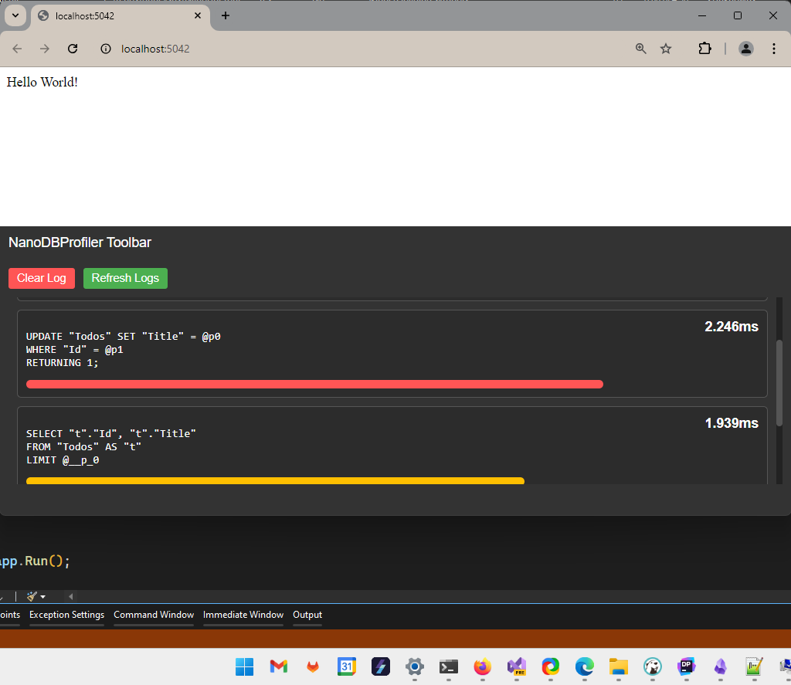

# Entity Framework Profiler for ASP.Net Core


A tiny profiler without hassle. 



```
┌────────────────────────────────────────────────────────────────────────────────┐
│                                                                                │
│                                                                                │
│                                                                                │
│    ██████   █████                                  ██████████   ███████████    │
│   ░░██████ ░░███                                  ░░███░░░░███ ░░███░░░░░███   │
│    ░███░███ ░███   ██████   ████████    ██████     ░███   ░░███ ░███    ░███   │
│    ░███░░███░███  ░░░░░███ ░░███░░███  ███░░███    ░███    ░███ ░██████████    │
│    ░███ ░░██████   ███████  ░███ ░███ ░███ ░███    ░███    ░███ ░███░░░░░███   │
│    ░███  ░░█████  ███░░███  ░███ ░███ ░███ ░███    ░███    ███  ░███    ░███   │
│    █████  ░░█████░░████████ ████ █████░░██████     ██████████   ███████████    │
│   ░░░░░    ░░░░░  ░░░░░░░░ ░░░░ ░░░░░  ░░░░░░     ░░░░░░░░░░   ░░░░░░░░░░░     │
│                                                                                │
│                                                                                │
│                                                                                │
│    ███████████                        ██████   ███  ████                       │
│   ░░███░░░░░███                      ███░░███ ░░░  ░░███                       │
│    ░███    ░███ ████████   ██████   ░███ ░░░  ████  ░███   ██████  ████████    │
│    ░██████████ ░░███░░███ ███░░███ ███████   ░░███  ░███  ███░░███░░███░░███   │
│    ░███░░░░░░   ░███ ░░░ ░███ ░███░░░███░     ░███  ░███ ░███████  ░███ ░░░    │
│    ░███         ░███     ░███ ░███  ░███      ░███  ░███ ░███░░░   ░███        │
│    █████        █████    ░░██████   █████     █████ █████░░██████  █████       │
│   ░░░░░        ░░░░░      ░░░░░░   ░░░░░     ░░░░░ ░░░░░  ░░░░░░  ░░░░░        │
│                                                                                │
│                                                                                │
│                                                                                │
└────────────────────────────────────────────────────────────────────────────────┘
```

## Installation

```
dotnet add package NanoDbProfiler.AspNetCore --version 0.1.23-alpha-g1a0a4554d2 --source https://www.myget.org/F/guneysu/api/v3/index.json 
```

```csharp
// Configure service
services.AddNanoDbProfiler();


// Configure App
app.UseNanodbProfilerToolbar();
```


## Usage

- Toolbar will inject itself any html page.

## Warnings & Disclaimers
- DO NOT USE ON PRODUCTION SYSTEMS!
- This project is in very early stage,
- Started with EF Core 8.x, it did not tested over old EF Core versions
- There is no benchmark about profiler overhead

### Plain Text Query Dashboard

```http
GET http://localhost:5287/query-log
```

**Output**

```
P95: "26.044ms" Total: 1
-
SELECT COUNT(*) FROM "sqlite_master" WHERE "name" = '__EFMigrationsHistory' AND "type" = 'table';
---

P95: "6.618ms" Total: 2
-
INSERT INTO "Todos" ("Title")
VALUES (@p0)
RETURNING "Id";
---

P95: "0.796ms" Total: 1
-
SELECT "MigrationId", "ProductVersion"
FROM "__EFMigrationsHistory"
ORDER BY "MigrationId";
---

P95: "1.661ms" Total: 2
-
SELECT "t"."Id", "t"."Title"
FROM "Todos" AS "t"
---
```


### Query Dashboard in JSON format

```http
GET http://localhost:5287/query-log
Accept: application/json
```


**Outputs**

```json
{
  "summaries": [
    {
      "query": "SELECT COUNT(*) FROM \"sqlite_master\" WHERE \"name\" = '__EFMigrationsHistory' AND \"type\" = 'table';",
      "total": 1,
      "p95": 26.044
    },
    {
      "query": "INSERT INTO \"Todos\" (\"Title\")\r\nVALUES (@p0)\r\nRETURNING \"Id\";",
      "total": 2,
      "p95": 6.618
    },
    {
      "query": "SELECT \"MigrationId\", \"ProductVersion\"\r\nFROM \"__EFMigrationsHistory\"\r\nORDER BY \"MigrationId\";",
      "total": 1,
      "p95": 0.796
    },
    {
      "query": "SELECT \"t\".\"Id\", \"t\".\"Title\"\r\nFROM \"Todos\" AS \"t\"",
      "total": 2,
      "p95": 1.661
    }
  ]
}
```
